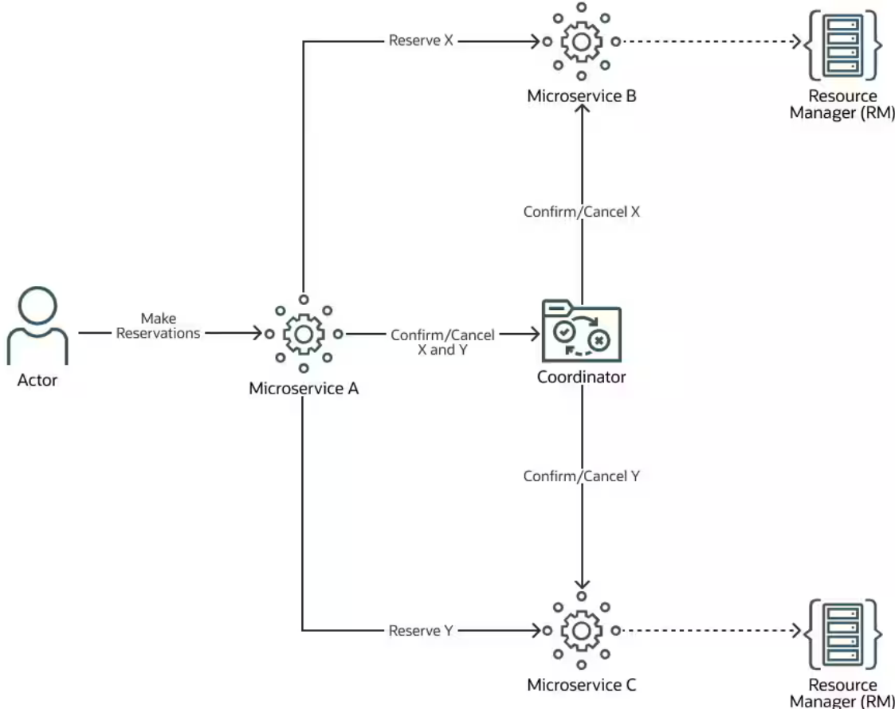
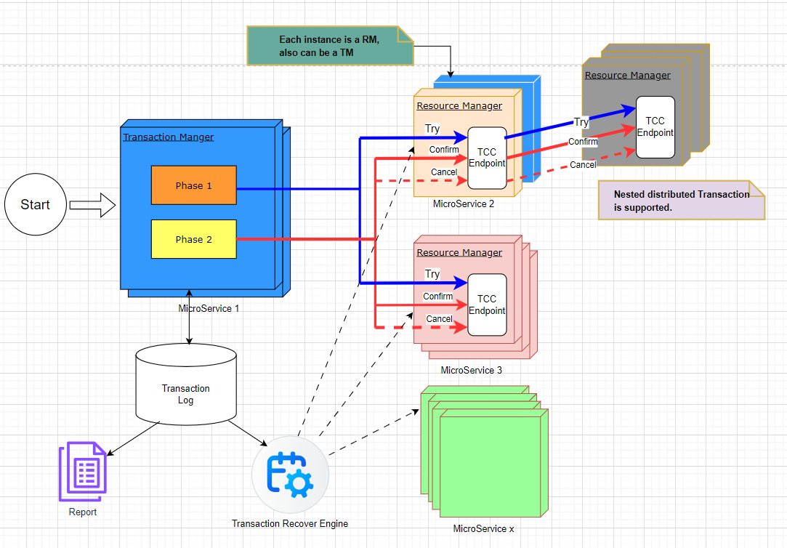

# SimpleTCC
Distributed Transaction - TCC framework

## What is a TCC?

Quote from Oracle:
>The Try-Confirm/Cancel (TCC) transaction protocol holds some resources in a reserved state until the transaction is either confirmed or canceled. If the transaction is canceled, the reserved resources are released and are available in the inventory. The TCC transaction protocol relies on the basic HTTP verbs: POST, PUT, and DELETE. Ensure that your application conforms to the following guidelines:

>The transaction initiator service must use the POST HTTP method to create a new reservation. As a response to this request, the transaction participant services must return a URI representing the reservation. The MicroTx client libraries places the URI in MicroTx specific headers to ensure that the URI is propagated up the call stack.

>This protocol relies upon the participant services to ensure that all participant services either confirm their reservations or cancel their reservations. The URIs must respond to the PUT HTTP method to confirm a reservation, and to the DELETE HTTP method to cancel a reservation.
https://blogs.oracle.com/database/post/making-try-confirmcancel-easy-with-microtx

## What is the difference for this SimpleTCC framework.

1. Decentralized

There is NO centralized Transaction Manager, and dedicated Resource manager, Why?

**No single point of failure, every running node in every micoservice can be a TM(Transaction Manager), and is a resource manager(RM).**

2. Support nested distributed transaction.
**It is okay to have a distributed transaction across different microservices,  a calling trace might like below**
   
        A->(B1, B2)

            B1->(C1,C2)

            B2->C3
3. It is simple, that is why, easy to integrate with Springboot, with below starter.
    see [Sample](stcc-samples/)
    basically add dependency, and specify the datasource. SampleTCC can share the same database for experimentation. 
```
   <dependency>
   <groupId>org.yaod</groupId>
   <artifactId>stcc-springboot-starter</artifactId>
   <version>1.0-SNAPSHOT</version>
   </dependency>
   ```
4. Simple TCC design.
   

5. TCC coordinator

```java
      @TryTCC(confirm = "confirmWithdraw", cancel = "cancelWithdraw", asyncCC = true)
public Account transferMoneyToAnotherBankAcct(String fromAccId, String toAccId, BigDecimal amount){
        LOGGER.info("trying withdraw");
        //Local transaction(DB).
        checkImpactedRows(mapper.tryWithdraw(fromAccId, amount));
        //RPC call.
        rpcClient.depositTo(toAccId, amount);

        return findBy(fromAccId);
}

public void confirmWithdraw(String fromAccId, String toAccId, BigDecimal amount){
        LOGGER.info("confirming");
        checkImpactedRows(mapper.confirmWithdraw(fromAccId, amount));
}

public void cancelWithdraw(String fromAccId, String toAccId, BigDecimal amount){
        LOGGER.info("cancelling");
        checkImpactedRows(mapper.cancelWithdraw(fromAccId, amount));
}
```

```java
@FeignClient(name= "rpcCall", url = "http://localhost:8081/")
@ParticipateTCC
public interface BankTransferInClient {
    @RequestMapping(method = RequestMethod.POST, value = "/accounts/transferTo/{accountTo}")
    @ParticipateTCC
    Object depositTo(@PathVariable("accountTo") String accountTo,@RequestParam("amount") BigDecimal amount);

```
